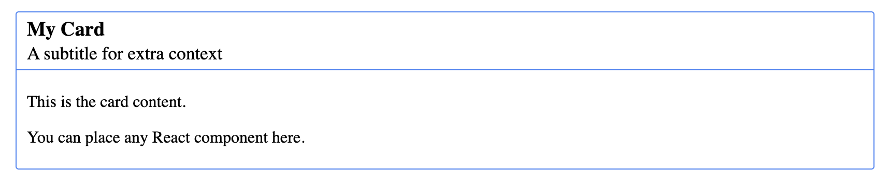
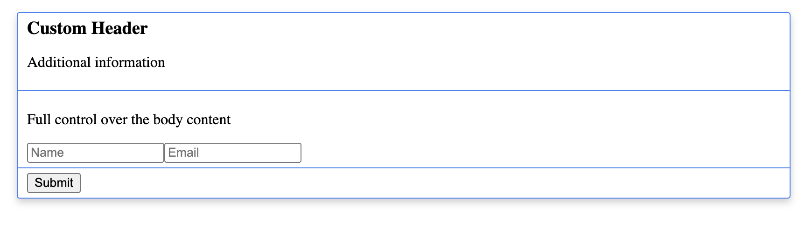

# @sio-group/ui-card

[](https://opensource.org/licenses/ISC)


A flexible and accessible card component for React applications.
The card supports both simple configuration through props and full layout control through composable subcomponents.

---

## Features

* 🎨 **Flexible composition** – Use `Card.Header`, `Card.Body`, and `Card.Footer`
* 🧩 **Two APIs** – Simple props-based usage or full composition control
* 🔧 **Configuration via props** – Or let the modal generate fallback components automatically
* 🎨 **Custom styling** – Supports custom classes and inline styles
* 📦 **Lightweight** – Minimal dependencies

---

## Installation

```bash
npm install @sio-group/ui-card
```

### Peer dependencies

This package requires:

* `react` ^19.0.0
* `react-dom` ^19.0.0

---

## Quick Example

```tsx
import { Card } from "@sio-group/ui-card";

function Example() {
    return (
        <Card title="Example">
          Hello world
        </Card>
    );
}
```

---

## Styling

Import the base modal styles:

```js
import "@sio-group/ui-card/sio-card-style.css";
```

---

## Basic Usage (Props)

The simplest way to use the card is by configuring it via props.

```tsx
import { Card } from "@sio-group/ui-card";

function App() {
  return (
    <>
      <Card
        title="My Card"
        subtitle="A subtitle for extra context"
      >
        <p>This is the card content.</p>
        <p>You can place any React component here.</p>
      </Card>
    </>
  );
}
```



*Example modal using fallback components*

---

## When to use Props vs Composition

The card can be used in two ways depending on the level of control you need.

### Props-based usage (recommended for most cases)

Use props when you only need a simple card with a title and content.
This approach is quick to implement and keeps your code concise.

```tsx
<Card
  title="Some title"
>
  This is awesome content
</Card>
```

### Composition API (for advanced layouts)

Use the composition API when you need full control over the card structure or custom layouts.

```tsx
<Card>
  <Card.Header>
    <h2>Custom Header</h2>
  </Card.Header>

  <Card.Body>
    Complex custom content
  </Card.Body>

  <Card.Footer>
    Custom footer
  </Card.Footer>
</Card>
```

In this mode you control the complete layout and behavior of each section.

---

## Composition API

The card can be composed using the following structure:

```
Card
 ├─ Card.Header
 ├─ Card.Body
 └─ Card.Footer
```

These components give you full control over the card layout.
If one of these components is omitted, the modal may generate a fallback automatically.

```tsx
import { Card } from "@sio-group/ui-card";

function App() {
  return (
    <>
      <Card addShadow>

        <Card.Header>
          <h2>Custom Header</h2>
          <p>Additional information</p>
        </Card.Header>

        <Card.Body>
          <div className="custom-content">
            <p>Full control over the body content</p>

            <form>
              <input type="text" placeholder="Name" />
              <input type="email" placeholder="Email" />
            </form>
          </div>
        </Card.Body>

        <Card.Footer>
          <button className="btn-primary">Submit</button>
        </Card.Footer>

      </Card>
    </>
  );
}
```



*card modal using composition*

---

## API Reference

### Modal Props

| Prop              | Type                           | Default | Description                                 |
|-------------------|--------------------------------|---------|---------------------------------------------|
| `addShadow`       | `boolean`                      | `false` | Controls whether the card has a shadow      |
| `children`        | `ReactNode`                    | —       | Modal content                               |
| `className`       | `string`                       | —       | Additional CSS classes for the modal dialog |
| `style`           | `CSSProperties`                | —       | Inline styles for the modal dialog          |
| `title`           | `string`                       | —       | Title used by the fallback header           |
| `subtitle`        | `string`                       | —       | Subtitle used by the fallback header        |
| `actions`         | `(ButtonProps \| LinkProps)[]` | —       | Action buttons (from `@sio-group/ui-core`)  |

---

## Subcomponents

### Card.Header

| Prop        | Type         | Default | Description             |
|-------------|--------------|---------|-------------------------|
| `children`  | `ReactNode`  | —       | Header content          |

---

### Card.Body

| Prop       | Type        | Description       |
|------------|-------------|-------------------|
| `children` | `ReactNode` | Card body content |

---

### Card.Footer

| Prop       | Type        | Description    |
|------------|-------------|----------------|
| `children` | `ReactNode` | Footer content |

### @SiO-group/form-react integration

When using `@sio-group/form-react` inside a `Card`, the form is rendered as part of the card content.

By default the entire form (fields and buttons) is rendered inside the card body.

To integrate the form with the card layout, you can map the form containers to the card subcomponents:

```tsx
<Card>
  <Form
  ...
  container={Card.Body}
  buttonContainer={Card.Footer}
  />
</Card>
```

In this case:

- the form fields are rendered inside Card.Body
- the form buttons are rendered inside Card.Footer

---

## Automatic Fallback Components

If you do not provide subcomponents, the card will generate them automatically.

* **Header**
  Generated when `title` or `subtitle` is present.

* **Body**
  Generated from all children that are not `Card.Header` or `Card.Footer`.

* **Footer**
  Generated when the `actions` prop is provided (and not empty).

---

## TypeScript

This package includes full TypeScript definitions.

```ts
import { Card, CardProps } from "@sio-group/ui-card";
```

---

## Browser Support

The modal supports all modern browsers that support:

* ES6 modules
* React portals

---

## Contributing

Please read [CONTRIBUTING.md](../../CONTRIBUTING.md) for details on our code of conduct and the process for submitting pull requests.

## License

This project is licensed under the ISC License - see the [LICENSE](../../LICENSE) file for details.