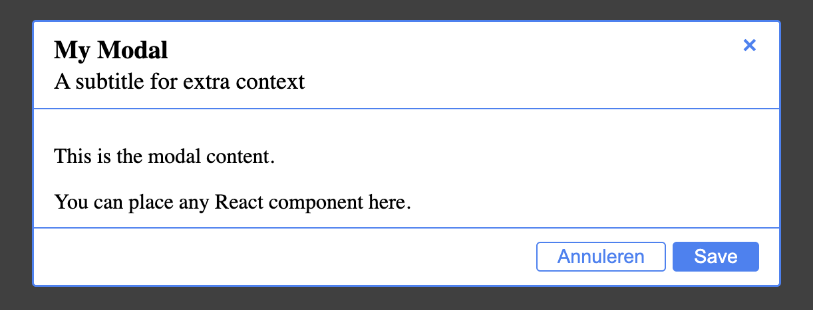
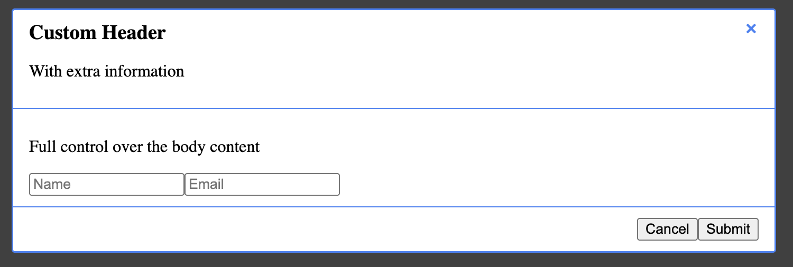

# @sio-group/ui-modal

[](https://opensource.org/licenses/ISC)


A flexible and accessible modal component for React applications.
The modal supports both simple configuration through props and full layout control through composable subcomponents.

---

## Features

* 🎨 **Flexible composition** – Use `Modal.Header`, `Modal.Body`, and `Modal.Footer`
* 🧩 **Two APIs** – Simple props-based usage or full composition control
* 🔧 **Configuration via props** – Or let the modal generate fallback components automatically
* ⌨️ **Accessible** – Close with ESC key and ARIA-labelled controls
* 🎯 **Portal rendering** – Render the modal outside the React component tree
* 🎨 **Custom styling** – Supports custom classes and inline styles
* 📦 **Lightweight** – Minimal dependencies
* 📱 **Responsive** – Multiple predefined modal sizes

---

## Installation

```bash
npm install @sio-group/ui-modal
```

### Peer dependencies

This package requires:

* `react` ^19.0.0
* `react-dom` ^19.0.0

---

## Quick Example

```tsx
import { Modal } from "@sio-group/ui-modal";
import { useState } from "react";

function Example() {
    const [open, setOpen] = useState(false);

    return (
        <Modal show={open} close={() => setOpen(false)} title="Example">
          Hello world
        </Modal>
    );
}
```

---

## Styling

Import the base modal styles:

```js
import "@sio-group/ui-modal/sio-modal-style.css";
```

Optional: import core styles if you want to use the default button styling.

```js
import "@sio-group/ui-core/sio-core-style.css";
```

---

## Usage

The modal is a **controlled component**.
You are responsible for managing the open/close state using the `show` prop.

---

## Basic Usage (Props)

The simplest way to use the modal is by configuring it via props.

```tsx
import { Modal } from "@sio-group/ui-modal";
import { useState } from "react";

function App() {
  const [showModal, setShowModal] = useState(false);

  return (
    <>
      <button onClick={() => setShowModal(true)}>Open Modal</button>

      <Modal
        show={showModal}
        close={() => setShowModal(false)}
        title="My Modal"
        subtitle="A subtitle for extra context"
        size="md"
        actions={[
          {
            label: "Save",
            variant: "primary",
            onClick: () => console.log("Save"),
          },
        ]}
      >
        <p>This is the modal content.</p>
        <p>You can place any React component here.</p>
      </Modal>
    </>
  );
}
```



*Example modal using fallback components*

---

## When to use Props vs Composition

The modal can be used in two ways depending on the level of control you need.

### Props-based usage (recommended for most cases)

Use props when you only need a simple modal with a title, content and actions.
This approach is quick to implement and keeps your code concise.

```tsx
<Modal
  show={open}
  close={() => setOpen(false)}
  title="Confirm action"
  actions={[
    { label: "Cancel", onClick: () => setOpen(false) },
    { label: "Confirm", variant: "primary", onClick: handleConfirm }
  ]}
>
  Are you sure?
</Modal>
```

### Composition API (for advanced layouts)

Use the composition API when you need full control over the modal structure or custom layouts.

```tsx
<Modal show={open} close={() => setOpen(false)}>
  <Modal.Header>
    <h2>Custom Header</h2>
  </Modal.Header>

  <Modal.Body>
    Complex custom content
  </Modal.Body>

  <Modal.Footer>
    Custom buttons
  </Modal.Footer>
</Modal>
```

In this mode you control the complete layout and behavior of each section.

---

## Composition API

The modal can be composed using the following structure:

```
Modal
 ├─ Modal.Header
 ├─ Modal.Body
 └─ Modal.Footer
```

These components give you full control over the modal layout.
If one of these components is omitted, the modal may generate a fallback automatically.

```tsx
import { Modal } from "@sio-group/ui-modal";
import { useState } from "react";

function App() {
  const [showModal, setShowModal] = useState(false);

  return (
    <>
      <button onClick={() => setShowModal(true)}>Open Modal</button>

      <Modal show={showModal} close={() => setShowModal(false)} size="lg">

        <Modal.Header showClose close={() => setShowModal(false)}>
          <h2>Custom Header</h2>
          <p>Additional information</p>
        </Modal.Header>

        <Modal.Body>
          <div className="custom-content">
            <p>Full control over the body content</p>

            <form>
              <input type="text" placeholder="Name" />
              <input type="email" placeholder="Email" />
            </form>
          </div>
        </Modal.Body>

        <Modal.Footer>
          <button onClick={() => setShowModal(false)}>Cancel</button>
          <button className="btn-primary">Submit</button>
        </Modal.Footer>

      </Modal>
    </>
  );
}
```



*Example modal using composition*

---

## API Reference

### Modal Props

| Prop              | Type                           | Default         | Description                                                                                                                                   |
|-------------------|--------------------------------|-----------------|-----------------------------------------------------------------------------------------------------------------------------------------------|
| `show`            | `boolean`                      | —               | Controls whether the modal is visible                                                                                                         |
| `close`           | `() => void`                   | —               | Function called when the modal should close                                                                                                   |
| `children`        | `ReactNode`                    | —               | Modal content                                                                                                                                 |
| `portalTarget`    | `string \| Element`            | `'#modal-root'` | CSS selector or DOM element where the modal portal will be rendered. If the target cannot be found, the modal falls back to `document.body.`  |
| `className`       | `string`                       | —               | Additional CSS classes for the modal dialog                                                                                                   |
| `style`           | `CSSProperties`                | —               | Inline styles for the modal dialog                                                                                                            |
| `title`           | `string`                       | —               | Title used by the fallback header                                                                                                             |
| `subtitle`        | `string`                       | —               | Subtitle used by the fallback header                                                                                                          |
| `showClose`       | `boolean`                      | `true`          | Shows close button in fallback header/footer                                                                                                  |
| `closeOnEsc`      | `boolean`                      | `true`          | Enables closing the modal by pressing ESC                                                                                                     |
| `closeOnBackdrop` | `boolean`                      | `true`          | Enables closing the modal by clicking the backdrop                                                                                            |
| `actions`         | `(ButtonProps \| LinkProps)[]` | —               | Action buttons (from `@sio-group/ui-core`)                                                                                                    |
| `size`            | `'sm' \| 'md' \| 'lg' \| 'xl'` | `'md'`          | Modal size                                                                                                                                    |

---

## Subcomponents

### Modal.Header

| Prop        | Type         | Default | Description             |
|-------------|--------------|---------|-------------------------|
| `children`  | `ReactNode`  | —       | Header content          |
| `showClose` | `boolean`    | true    | Displays a close button |
| `close`     | `() => void` | —       | Close handler           |

---

### Modal.Body

| Prop       | Type        | Description        |
|------------|-------------|--------------------|
| `children` | `ReactNode` | Modal body content |

---

### Modal.Footer

| Prop       | Type        | Description    |
|------------|-------------|----------------|
| `children` | `ReactNode` | Footer content |

### @SiO-group/form-react integration

When using `@sio-group/form-react` inside a `Modal`, the form is rendered as part of the modal content.

By default:

- the entire form (fields and buttons) is rendered inside the modal body 
- the modal will still render its default footer

To integrate the form with the modal layout, you can map the form containers to the modal subcomponents:

```tsx
<Modal show={showModal} close={...}>
  <Form
    ...
    container={Modal.Body}
    buttonContainer={Modal.Footer}
  />
</Modal>
```

In this case:

- the form fields are rendered inside Modal.Body
- the form buttons are rendered inside Modal.Footer
- the modal will not render its default body and footer
- if you need a cancel button to close the modal, include it in the form configuration

---

## Automatic Fallback Components

If you do not provide subcomponents, the modal will generate them automatically.

* **Header**
  Generated when `title`, `subtitle`, or `showClose` is enabled.

* **Body**
  Generated from all children that are not `Modal.Header` or `Modal.Footer`.

* **Footer**
  Generated when the `actions` prop is provided (and not empty), or `showClose` is enabled.

---

## Portal Target

By default, the modal searches for an element with:

```html
<div id="modal-root"></div>
```

If none is found, the modal renders into `document.body`.

You can override this behaviour:

```tsx
<Modal portalTarget="#custom-modal-root">
  Content
</Modal>
```

Or pass a DOM element:

```tsx
const element = document.getElementById("custom-root");

<Modal portalTarget={element}>
  Content
</Modal>
```

---

## Accessibility

The modal includes basic accessibility support:

* `role="dialog"` and `aria-modal="true"` for screen readers
* Focus moves to the modal when it opens
* The modal dialog receives focus automatically when opened
* ESC key closes the modal (can be disabled via `closeOnEsc`)
* Clicking the backdrop closes the modal (can be disabled via `closeOnBackdrop`)
* Optional close buttons (`showClose`)
* Close buttons include ARIA labels

---

## TypeScript

This package includes full TypeScript definitions.

```ts
import { Modal, ModalProps } from "@sio-group/ui-modal";
```

---

## Browser Support

The modal supports all modern browsers that support:

* ES6 modules
* React portals

---

## Contributing

Please read [CONTRIBUTING.md](../../CONTRIBUTING.md) for details on our code of conduct and the process for submitting pull requests.

## License

This project is licensed under the ISC License - see the [LICENSE](../../LICENSE) file for details.